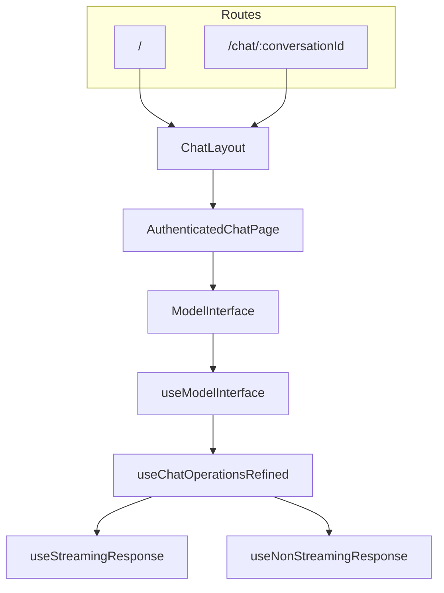

# Frontend architecture (AIGenius)

Single map for humans and tooling: how the Next.js app is wired, where to edit behavior, and where deeper docs live.

## Canonical docs index

| Document | Purpose |
|----------|---------|
| [README.md](./README.md) | Setup, env, scripts, high-level tree |
| This file | Routes, data flow, conventions, “where to change X” |
| [DESIGN_SYSTEM.md](./DESIGN_SYSTEM.md) | Tokens, typography, layout, UI vocabulary |
| [src/app/components/model-interface/README.md](./src/app/components/model-interface/README.md) | Session lifecycle, `useSessionSwitcher`, backend endpoints |
| [docs/archive/README.md](./docs/archive/README.md) | Historical / one-off notes (auth refactor, plus-button explorations) |
| [docs/guides/](./docs/guides/) | Longer how-tos (e.g. lightweight modal pattern) |

## App Router map

- **Shell**: `src/app/layout.tsx` — fonts, global styles, providers.
- **Views group**: `src/app/(views)/layout.tsx` — shell chrome, logged-user hydration for most routes.
- **Chat surface** (main product UI):
  - `src/app/(views)/(chat)/layout.tsx` → renders **`AuthenticatedChatPage`** only (pages under this segment are placeholders for routing).
  - `src/app/(views)/(chat)/page.tsx` — satisfies `/`.
  - `src/app/(views)/(chat)/chat/[conversationId]/page.tsx` — satisfies `/chat/[conversationId]` (layout still owns the UI).
- **Auth pages**: `(views)/(auth)/`, **static docs**: `(views)/docs/`, **published chats**: `(views)/published-conversations/`, etc.

The chat UI does **not** unmount on `/` ↔ `/chat/:id` navigation: **`AuthenticatedChatPage`** reads `useParams().conversationId` and passes `routeConversationId` into **`ModelInterface`**.

## Data flow (chat)

- **`useModelInterface`** (`core/hooks/useModelInterface.ts`) composes model list, chat state, UI state, session switching, and wires **`useChatOperationsRefined`**.
- **`useChatOperationsRefined`** orchestrates send/stop, wallet checks, draft persistence, and delegates to streaming vs non-streaming hooks.
- **Streaming**: `useStreamingResponse` + `contentProcessing.utils` + `streamTranscriptGuard`.
- **Sessions / history**: `useSessionSwitcher`, `useChatData`, `lib/utils/modelChatConversationUtils`, and the model-interface README (state-first + backend sync).

## Where to change what

| Goal | Primary locations |
|------|-------------------|
| New chat route behavior, token-in-URL auth, loading gate | `AuthenticatedChatPage.tsx` |
| Overall chat page layout, sidebar, which hooks are composed | `ModelInterface.tsx`, `ModelInterfaceChatColumn.tsx` |
| Model list, picker modal, filters, recent models | `features/models/` |
| Send message, stop, streaming vs non-streaming, drafts | `features/chat/hooks/` (`useChatOperationsRefined`, `useStreamingResponse`, `useNonStreamingResponse`, `sendFlow.utils`, `messageOptimization.utils`) |
| Message bubble UI, tool cards, markdown | `features/messages/`, `features/message-types/`, `shared/components/MarkdownRenderer.tsx` |
| Session switch, conversation list, star/delete | `features/chat/hooks/useSessionSwitcher.ts`, `ChatHistorySidebar/`, `lib/utils/modelChatConversationUtils.ts` |
| URL ↔ active conversation sync, cross-tab | `conversation/` (`useSyncRouteConversationId`, `useCrossTabActiveConversationSync`, `routeConversationSync`) |
| Wallet / paywall gating | `useModelInterfaceWalletGate`, `useWalletManagement`, `features/chat/hooks` |
| Personas | `useModelInterfacePersonality`, modals under `features/modals/` |
| HTTP calls to backend | `lib/calls/` (thin callers), **`nobox-client/`** (schemas, `access-model`, generated-style APIs) |
| Shared frontend–backend labels (e.g. tool display names) | `src/shared/tool-display-names.ts` (keep in sync with backend) |
| React Query, axios setup | `lib/providers/ReactQueryProvider.tsx`, `lib/api/`, `servercall/` |

## Conventions

### Server vs client

- **Server Components** by default where there is no browser API and no interactivity.
- **`"use client"`** for anything using hooks, `window`, or event handlers. The main chat experience is client-heavy (`ModelInterface` and children).

### `lib/` vs `nobox-client/` vs `app/components`

- **`lib/`**: app-level utilities, hooks, `calls/` wrappers, storage helpers, constants.
- **`nobox-client/`**: API surface tied to the backend contract (e.g. `access-model`, auth helpers). Prefer calling through here for request shape and types when available.
- **`app/components/model-interface/`**: product feature code; prefer **feature folders** (`features/chat`, `features/models`) for new code.

### Hooks at `model-interface/` root vs under `features/`

- **Root `hooks/`** (e.g. `useModelInterfaceSessionRouting`, `useModelInterfaceWalletGate`): cross-cutting concerns wired from **`ModelInterface.tsx`**.
- **`features/*/hooks/`**: scoped to that feature (chat send flow, model list, file upload).

### File naming

- **`*.types.ts`**: shared types for a feature area.
- **`*.utils.ts`**: pure helpers (easier to unit test).
- **`*.constants.ts`**: configuration constants.
- Co-located tests: **`__tests__/`** next to the module under test.

### Do not duplicate

- Tool display names and other cross-layer copies: follow comments in `src/shared/tool-display-names.ts` and the backend twin.

## AI / LLM usage

1. Read this file and the **canonical docs index** above before large edits.
2. For session timing and API endpoints, confirm **`model-interface/README.md`**.
3. Prefer **small, tested** changes in `*.utils.ts` and hooks over growing `ModelInterface.tsx`.
4. After moving files, search the repo for old paths — **archive docs** under `docs/archive/` are not guaranteed linked from everywhere.
